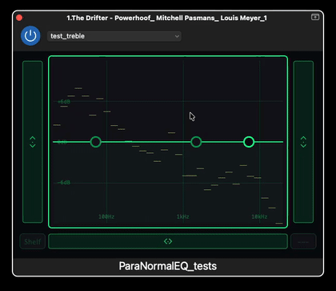

# ParaNormalEQ

**ParaNormalEQ** is a simple three-band parametric EQ with an interface designed for touch-screen interaction.

It provides low, mid, and high-frequency bands, with the EQ response displayed visually and the main parameters controlled through large, touch-friendly controls.

  

## Why ParaNormalEQ?

Three-band EQs are common in audio effects, but their traditional interfaces are usually designed around small knobs or sliders.

ParaNormalEQ explores a simpler approach:

* **Three familiar EQ bands:** low shelf, mid bell, and high shelf.
* **Direct visual interaction:** the EQ response and band positions are visible in the main display.
* **Touch-friendly controls:** frequency, gain, and Q can be adjusted using larger vertical controls.
* **Simple interaction:** the aim is to make a conventional EQ comfortable to use on a touch screen without making it more complicated than necessary.

The project is particularly intended for use in audio effects where a full parametric EQ interface may be unnecessary, but some tonal control is still useful.

## What's next?

One of the things I would like to explore is how different types of EQ interfaces work when integrated into effects that do not traditionally include an EQ, such as **delay and reverb**.

Comparisons between different EQ approaches and different effects will be part of the next stage of the project.

## Current status

ParaNormalEQ is an experimental prototype.

The current version focuses on the interaction design and on exploring how a familiar three-band EQ can be adapted for touch-screen use.

Feedback and suggestions are very welcome.

---

**ParaNormalEQ**
A simple three-band EQ, designed for touch.

<!-- 

ffmpeg -i pneq_movie.mov \
  -vf "fps=7,scale=420:-1:flags=lanczos,split[s0][s1];[s0]palettegen[p];[s1][p]paletteuse" \
  -loop 0 paranormaleq-demo.gif

 -->